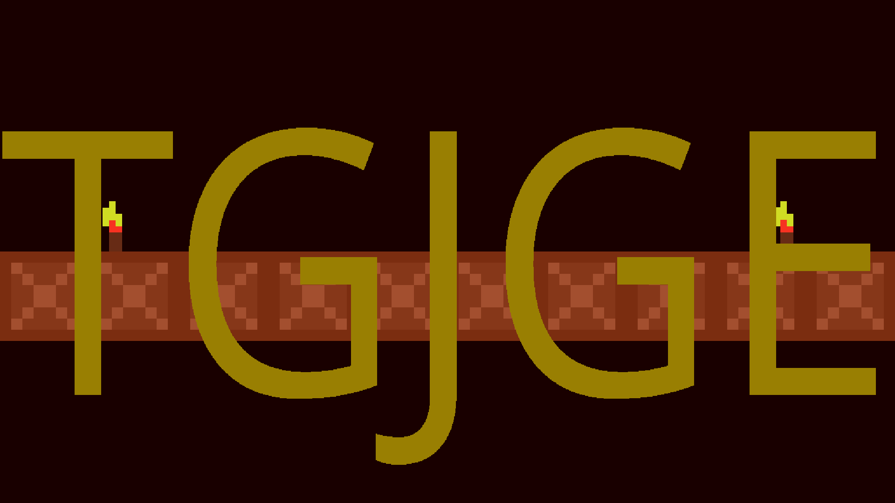

# TGJGE

Welcome this is a 2D game engine called TGJGE.



It simply stands for T3V's Game Jam Game Engine.
The engine is written in C with OpenGL3.3 to get the biggest compatibility possible. This way
it is easily usable in C and C++.

You are free to use/modify/distribute the engine for your games or projects. It would be nice to mention my name though.

To get the current version of the repo just use the following two
git commands.

```
git@github.com:tevoran/TGJGE.git
git submodule update --init --recursive
```

## Dependencies

The game engine is designed to have light dependencies and a high
portability across various platforms. Therefore you only need 
SDL2, SDL2_ttf, GLEW and OpenGL3.3 available on your system to
compile the engine with a C99 compiler.

There are now different parts of the engine. There is a small and
portable core in C, which is basically the engine with all the
important stuff. The core of the engine is located in src. When
compiling with CMake it gets compiled into a static library.
And currently work is done to create a graphical level editor for
the engine named TGE. It is written in C++ and uses the API
by the engine core library.

### Compilation

The compilation of the engine TGJGE in the src directory itself
should be quite easy. Just configure your compiler to its
dependencies (SDL2, SDL2_ttf, GLEW and OpenGL3.3) after the
submodule initialization. Then you should be able to use the
engine as a library.
Alternatively you can use CMake now as well.

#### Linux

Compilation on Linux can be done by the following commands:


first time building:
```
mkdir build
cd build
```

after that:
```
cmake ..
make
```

Then you will have a static library called libtgjge, a test
executable to test out stuff with the engine API and an executable
of the editor TGE (the executable is named tge).

